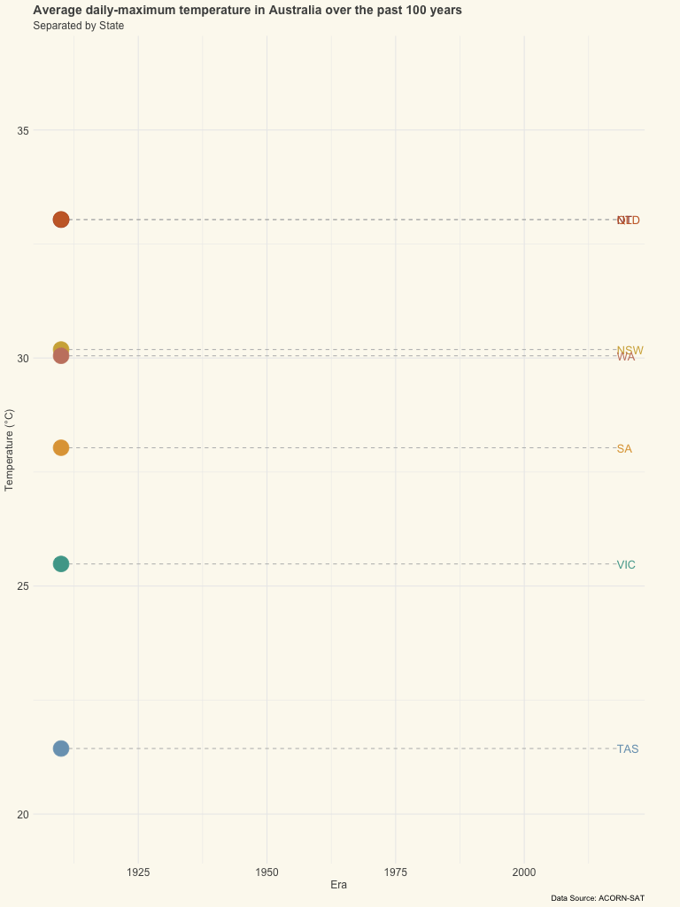

```{r setup, include=FALSE}
knitr::opts_chunk$set(echo = TRUE)
```

# The Data

In a [previous analysis](https://perkot.github.io/ACORN-SAT-Climate-Data/), I explored publicly available data from the [Bureau of Meteorology](http://www.bom.gov.au/climate/data/acorn-sat/#tabs=ACORN%E2%80%90SAT) to examine change in Australian temperatures over the past 100 years. In this page we will utilize the power off ggplot2 to visualise the data

Let's load our dependencies 

```{r Load dependencies, results='hide', message=FALSE, warning=FALSE}
require(tidyverse)
require(readr)
require(ggplot2)
require(gganimate)
require(viridis)
require(scales)
require(gifski)
require(png)
require(transformr)
require(kableExtra)
```

& read-in the pre-cleaned temperature data from the previous kernel 

```{r function to data, results='hide', message=FALSE, warning=FALSE}
tbl <- read.csv("/Users/perkot/GIT/data/ACORN-SAT-Clean.csv")
```

```{r print table preview, echo=FALSE}
# Print table 
tbl %>% 
  select(site.name , 
         date, 
         minimum.temperature..degC., 
         maximum.temperature..degC., 
         Year) %>%
  head(10) %>% 
  kable() %>% #head limits to just top rows
  kable_styling(bootstrap_options = c("striped", 
                                      "hover", 
                                      "condensed", 
                                      "responsive", 
                                      font_size = 8))
```

```{r variable cleaning, results='hide', message=FALSE, warning=FALSE, echo=FALSE}
# as character
tbl$Era <- as.character(tbl$Era)
# remove s
tbl$Era = substr(tbl$Era,1,nchar(tbl$Era)-1)
# to numeric
tbl$Era <- as.numeric(tbl$Era)
```


If using a mac, you may encounter some teething issues rendering visualizations with gganimate. [This resource](https://www.youtube.com/watch?v=VfLRhPEuYDc) provides a guide of steps to troubleshoot in terminal. Otherwise, we should be good-to-go.

# Monthly avg maximum temperatures

## Animated by year 

In the below step, I create customer colour palettes to give full manual control of which colours are assigned to which element in the visualisation (in the below example, state of Australia)

```{r colour themes}
# color themes 
state.colors.gradient.2 <- 
  c("NT" = "#993B37", 
    "TAS" = "#7AA2BE", 
    "VIC" = "#4EA599",  
    "SA" = "#E1A345", 
    "NSW" = "#D2AF47", 
    "WA" = "#C88370", 
    "QLD" = "#CA6A33") 

state.colors.gradient.3 <- 
  c("NT" = "#993B37", 
    "TAS" = "#7AA2BE", 
    "VIC" = "#4ea58e",  
    "SA" = "#e3963d", 
    "NSW" = "#D2AF47", 
    "WA" = "#d97529", 
    "QLD" = "#c95042") 
```

To avoid repetition in our code, we can pre-save some of the custom theme elements to call in each visualisation (i.e. font sizes, font colours, legend formatting)

```{r plot themes}
# Themes for plot visualisations 
theme_plot <-
  theme(
    plot.title = element_text(size = 14, hjust = 0, colour = "#4E4F4E", face = "bold"),
    plot.subtitle = element_text(size = 12, hjust = 0, colour = "#4E4F4E"),
    axis.title = element_text(size = 12, colour = "#4E4F4E"),
    legend.title = element_text(size = 12, colour = "#4E4F4E"),
    axis.text = element_text(size = 12, colour = "#4E4F4E"),
    panel.background = element_rect(fill = "#fcf9f0",
                                    colour = "#fcf9f0"),
    plot.background = element_rect(fill = "#fcf9f0",
                                   colour = "#fcf9f0"))

theme_plot_2 <-
  theme(
    plot.title = element_text(size = 12, hjust = 0, colour = "#4E4F4E", face = "bold"),
    plot.subtitle = element_text(size = 10, hjust = 0, colour = "#4E4F4E"),
    axis.title = element_text(size = 9, colour = "#4E4F4E"),
    legend.title = element_text(size = 10, hjust = 0.5, colour = "#4E4F4E"),
    axis.text = element_text(size = 9, colour = "#4E4F4E"),
    panel.background = element_rect(fill = "#fcf9f0",
                                    colour = "#fcf9f0"),
    plot.background = element_rect(fill = "#fcf9f0",
                                   colour = "#fcf9f0"))
```

For the first visualization, the average maximum temperature will be visualized for each state of Australia. This will be animated over each decade from 1900 up to 2010 

As such the first required step is to group the dataframe by both state and decade, summarizing by the mean maximum temperature

create plot

```{r create plot}
# PLOT
state.plot.2 <- 
  tbl %>% 
  group_by(State, Era) %>% # group data by state, decade
  filter(Era != 2019) %>% # filter year with incomplete data
  summarise(avgmax = mean(maximum.temperature..degC., na.rm = TRUE)) %>% # calculate mean 
  ggplot(aes(Era, avgmax, group = State, color = State)) + # plot
  geom_line(size = 1.6) + 
  geom_segment(aes(xend = 2018, yend = avgmax), linetype = 2, colour = 'grey') + 
  geom_point(size = 8) + 
  geom_text(aes(x = 2018, label = State, size = 16), hjust = 0) + 
  scale_colour_manual(values = state.colors.gradient.2) +
  coord_cartesian(clip = 'off') + 
  labs(title = 'Average daily-maximum temperature in Australia over the past 100 years',
       subtitle = 'Separated by State',
       caption  = "Data Source: ACORN-SAT",
       y = 'Temperature (°C)',
       X = "Year") +
  theme_minimal() + 
  theme(legend.position = "none") +
  theme(plot.margin = margin(5.5, 40, 5.5, 5.5)) + 
  theme_plot +
  transition_reveal(Era) 
```

```{r animate plot}
# ANIMATE PLOT
state.plot.2.anim <-
animate(state.plot.2,
        end_pause = 80,
        fps = 30,
        nframe = 240,
        height = 1024,
        width = 768)
```

### All Seasons

```{r save plot, results='hide', message=FALSE, warning=FALSE, echo=FALSE}
# SAVE PLOT 
anim_save("state.plot.2.anim.gif",
          state.plot.2.anim,
          width = 4000, 
          height = 4000)
```


  

### Summer

```{r create plot summer, results='hide', message=FALSE, warning=FALSE, echo=FALSE}
# PLOT
state.plot.summer <- 
  tbl %>% 
  filter(Season == "Summer") %>% 
  group_by(State, Era) %>% # group data by state, decade
  filter(Era != 2019) %>% # filter year with incomplete data
  summarise(avgmax = mean(maximum.temperature..degC., na.rm = TRUE)) %>% # calculate mean 
  ggplot(aes(Era, avgmax, group = State, color = State)) + # plot
  geom_line(size = 1.6) + 
  geom_segment(aes(xend = 2018, yend = avgmax), linetype = 2, colour = 'grey') + 
  geom_point(size = 8) + 
  geom_text(aes(x = 2018, label = State, size = 16), hjust = 0) + 
  scale_colour_manual(values = state.colors.gradient.2) +
  coord_cartesian(clip = 'off') + 
  labs(title = 'Average daily-maximum temperature in Australia over the past 100 years',
       subtitle = 'Separated by State',
       caption  = "Data Source: ACORN-SAT",
       y = 'Temperature (°C)',
       X = "Year") +
  theme_minimal() + 
  theme(legend.position = "none") +
  theme(plot.margin = margin(5.5, 40, 5.5, 5.5)) + 
  theme_plot +
  transition_reveal(Era) 
```

```{r animate plot summer, results='hide', message=FALSE, warning=FALSE, echo=FALSE}
# ANIMATE PLOT
state.plot.summer.anim <-
animate(state.plot.summer,
        end_pause = 80,
        fps = 30,
        nframe = 240,
        height = 1024,
        width = 768)
```

```{r save plot summer, results='hide', message=FALSE, warning=FALSE, echo=FALSE}
# SAVE PLOT 
anim_save("state.plot.summer.anim.gif",
          state.plot.summer.anim,
          width = 4000, 
          height = 4000)
```

### 

### Winter

```{r create plot winter, results='hide', message=FALSE, warning=FALSE, echo=FALSE}
# PLOT
state.plot.winter <- 
  tbl %>% 
  filter(Season == "Winter") %>% 
  group_by(State, Era) %>% # group data by state, decade
  filter(Era != 2019) %>% # filter year with incomplete data
  summarise(avgmax = mean(maximum.temperature..degC., na.rm = TRUE)) %>% # calculate mean 
  ggplot(aes(Era, avgmax, group = State, color = State)) + # plot
  geom_line(size = 1.6) + 
  geom_segment(aes(xend = 2018, yend = avgmax), linetype = 2, colour = 'grey') + 
  geom_point(size = 8) + 
  geom_text(aes(x = 2018, label = State, size = 16), hjust = 0) + 
  scale_colour_manual(values = state.colors.gradient.2) +
  coord_cartesian(clip = 'off') + 
  labs(title = 'Average daily-maximum temperature in Australia over the past 100 years',
       subtitle = 'Separated by State',
       caption  = "Data Source: ACORN-SAT",
       y = 'Temperature (°C)',
       X = "Year") +
  theme_minimal() + 
  theme(legend.position = "none") +
  theme(plot.margin = margin(5.5, 40, 5.5, 5.5)) + 
  theme_plot +
  transition_reveal(Era) 
```

```{r animate plot winter, results='hide', message=FALSE, warning=FALSE, echo=FALSE}
# ANIMATE PLOT
state.plot.winter.anim <-
animate(state.plot.winter,
        end_pause = 80,
        fps = 30,
        nframe = 240,
        height = 1024,
        width = 768)
```

```{r save plot winter, results='hide', message=FALSE, warning=FALSE, echo=FALSE}
# SAVE PLOT 
anim_save("state.plot.winter.anim.gif",
          state.plot.winter.anim,
          width = 4000, 
          height = 4000)
```

### 

### Autumn

```{r create plot Autumn, results='hide', message=FALSE, warning=FALSE, echo=FALSE}
# PLOT
state.plot.Autumn <- 
  tbl %>% 
  filter(Season == "Autumn") %>% 
  group_by(State, Era) %>% # group data by state, decade
  filter(Era != 2019) %>% # filter year with incomplete data
  summarise(avgmax = mean(maximum.temperature..degC., na.rm = TRUE)) %>% # calculate mean 
  ggplot(aes(Era, avgmax, group = State, color = State)) + # plot
  geom_line(size = 1.6) + 
  geom_segment(aes(xend = 2018, yend = avgmax), linetype = 2, colour = 'grey') + 
  geom_point(size = 8) + 
  geom_text(aes(x = 2018, label = State, size = 16), hjust = 0) + 
  scale_colour_manual(values = state.colors.gradient.2) +
  coord_cartesian(clip = 'off') + 
  labs(title = 'Average daily-maximum temperature in Australia over the past 100 years',
       subtitle = 'Separated by State',
       caption  = "Data Source: ACORN-SAT",
       y = 'Temperature (°C)',
       X = "Year") +
  theme_minimal() + 
  theme(legend.position = "none") +
  theme(plot.margin = margin(5.5, 40, 5.5, 5.5)) + 
  theme_plot +
  transition_reveal(Era) 
```

```{r animate plot Autumn, results='hide', message=FALSE, warning=FALSE, echo=FALSE}
# ANIMATE PLOT
state.plot.Autumn.anim <-
animate(state.plot.Autumn,
        end_pause = 80,
        fps = 30,
        nframe = 240,
        height = 1024,
        width = 768)
```

```{r save plot Autumn, results='hide', message=FALSE, warning=FALSE, echo=FALSE}
# SAVE PLOT 
anim_save("state.plot.Autumn.anim.gif",
          state.plot.Autumn.anim,
          width = 4000, 
          height = 4000)
```

### 

### Spring

```{r create plot Spring, results='hide', message=FALSE, warning=FALSE, echo=FALSE}
# PLOT
state.plot.Spring <- 
  tbl %>% 
  filter(Season == "Spring") %>% 
  group_by(State, Era) %>% # group data by state, decade
  filter(Era != 2019) %>% # filter year with incomplete data
  summarise(avgmax = mean(maximum.temperature..degC., na.rm = TRUE)) %>% # calculate mean 
  ggplot(aes(Era, avgmax, group = State, color = State)) + # plot
  geom_line(size = 1.6) + 
  geom_segment(aes(xend = 2018, yend = avgmax), linetype = 2, colour = 'grey') + 
  geom_point(size = 8) + 
  geom_text(aes(x = 2018, label = State, size = 16), hjust = 0) + 
  scale_colour_manual(values = state.colors.gradient.2) +
  coord_cartesian(clip = 'off') + 
  labs(title = 'Average daily-maximum temperature in Australia over the past 100 years',
       subtitle = 'Separated by State',
       caption  = "Data Source: ACORN-SAT",
       y = 'Temperature (°C)',
       X = "Year") +
  theme_minimal() + 
  theme(legend.position = "none") +
  theme(plot.margin = margin(5.5, 40, 5.5, 5.5)) + 
  theme_plot +
  transition_reveal(Era) 
```

```{r animate plot Spring, results='hide', message=FALSE, warning=FALSE, echo=FALSE}
# ANIMATE PLOT
state.plot.Spring.anim <-
animate(state.plot.Spring,
        end_pause = 80,
        fps = 30,
        nframe = 240,
        height = 1024,
        width = 768)
```

```{r save plot Spring, results='hide', message=FALSE, warning=FALSE, echo=FALSE}
# SAVE PLOT 
anim_save("state.plot.Spring.anim.gif",
          state.plot.Spring.anim,
          width = 4000, 
          height = 4000)
```

### 
